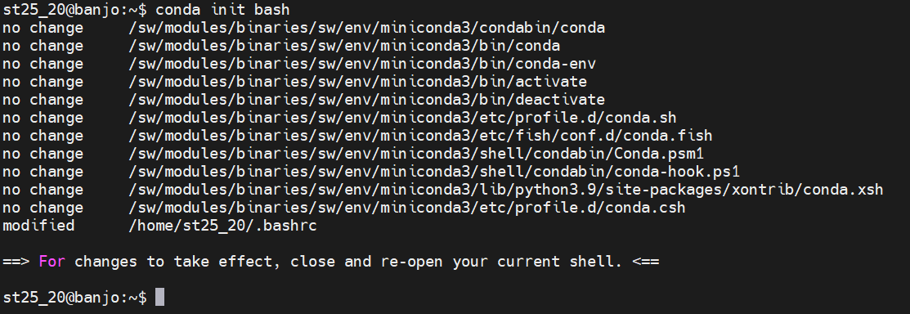

FINAL VERSION
{: .label .label-green }

# Conda

From the website, `conda` provides ["Package, dependency and environment management for any language"](https://docs.conda.io/en/latest/).

Conda is a package manager allows specific versions of programs to be installed, alongside their dependencies.
Different sets of programs can be installed to different [virtual environments](https://www.anaconda.com/moving-conda-environments/).
A virtual environment is basically a set of programs.

## Installing `conda`

Conda is part of [Anaconda](https://www.anaconda.com/distribution/), which is available for free.
Conda is also available either through [Miniconda](https://docs.conda.io/en/latest/miniconda.html) or through [Miniforge](https://conda-forge.org/). Both are free minimal installer, although the latter is the most widely used and actively maintained by the conda-forge community. Miniforge includes both the classic conda package manager and the high-performance mamba package manager. Conda and mamba commands are fully interoperable. The executables can be found at [Conda-forge download page](https://conda-forge.org/download/), while more details are available at [Conda-forge github page](https://github.com/conda-forge/miniforge).
 

Miniforge can be installed for example on a 64-bit Linux system with the following commands:

```bash
# Downloading miniconda
$ wget https://github.com/conda-forge/miniforge/releases/latest/download/Miniforge3-Linux-x86_64.sh

# Installing miniconda
$ bash Miniforge3-$(uname)-$(uname -m).sh
```

## Cloning and activating a `conda` environment

Conda virtual environments can be shared, either as a `.yml` file or a `.txt` file.
A `.yml` copy of a conda environment can be used to recreate that environment on another machine, regardless of the operating system platform used.
A `.txt` copy of a conda environment is more explicit: it can be used to create an identical copy of a conda environment using the same operating system platform as the original machine.


A conda environment can be activated using `$ conda activate name_of_environment`.
Once activated, all the programs installed in this environment will become available.
<br>

Conda can be deactivated using `$ conda deactivate`.


## Further reading
1. Downloading conda: <https://docs.conda.io/projects/conda/en/latest/user-guide/install/download.html>
2. Conda packages: <https://docs.conda.io/projects/conda/en/latest/user-guide/concepts/packages.html>
3. Conda environments: <https://docs.conda.io/projects/conda/en/latest/user-guide/concepts/environments.html>


## Configure the prompt 

In order to configure the prompt and be able to use conda, you need to run the following command

```bash
eval "$(/course/tadb/miniconda3/bin/conda shell.bash hook)"
```

Now you will be able to use the conda exec.

In order to use the conda environments, you need to run the following command:

```bash
conda init bash
```

