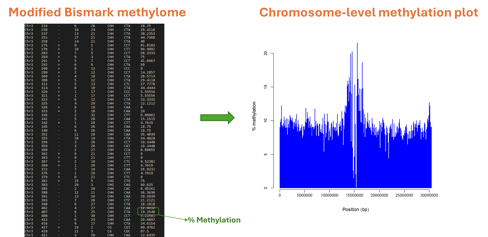
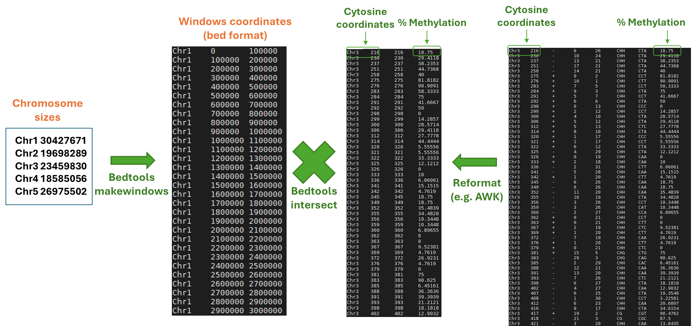
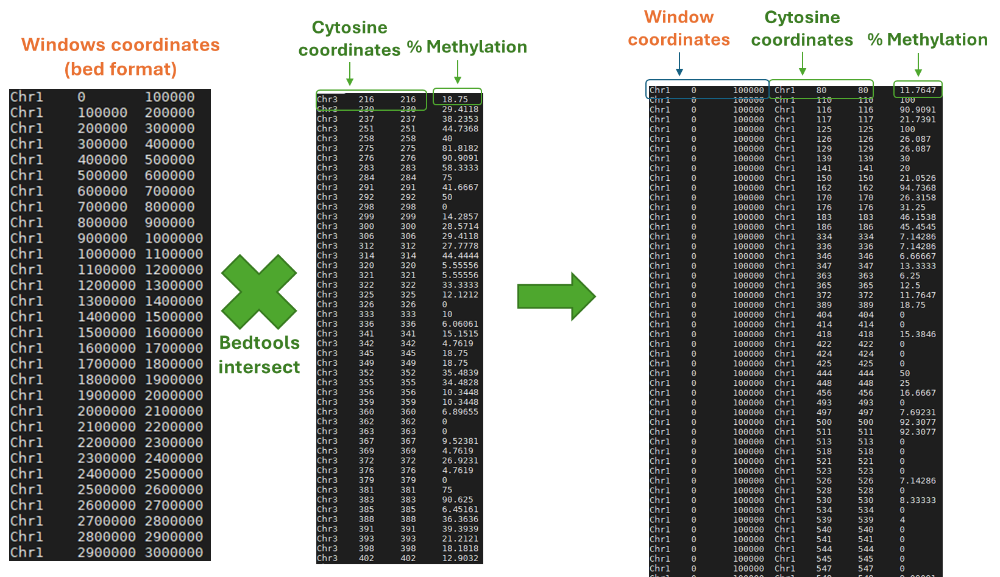
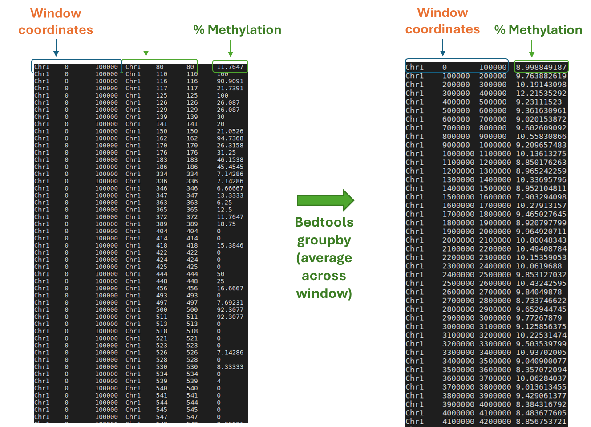

Final version
{: .label .label-green }

{: .important-title }
> Aim
>
> Obtain a graph with the window distribution of methylation values across a chromosome in three contexts `CG`, `CHG` and `CHH`, using `bedtools`.

<br>
<details open markdown="block">
  <summary>
    <strong>Table of contents</strong>
  </summary>
  {: .text-delta }
- TOC
{:toc}
</details>
<br>


We will now repeat the same analysis as done previously (a chromosome distribution of the methylation), but in this case the windows and raw data to be imported in `R` for the final graph will be obtained using `bedtools`.

Bedtools is a software package for the manipulation of genomic datasets. It is designed to be fast, flexible, and relatively easy to use. It is particularly useful for the analysis of large genomic datasets. It is written in C++ and is available for Linux, MacOS and Windows. It is free and open source. It is available at [http://bedtools.readthedocs.io/en/latest/](http://bedtools.readthedocs.io/en/latest/).

You can find a detailed explanation [here](https://onedrive.live.com/?cid=YOUR_CID&resid=YOUR_RESID&authkey=YOUR_AUTHKEY&action=embedview).

In order to obtain the chromosome wide distribution of the average methylation values, we need to follow the following steps.

We will always begin from Bismark methylome output.


In order to draw the graph and use the Bismark file we need to know the chromosome sizes.The sizes can be used in combination with the command `bedtools makewindows` to create a file with the windows that will be used as interval for the graph. Windows can be then intersected with the Bismark file to obtain the methylation values for each window. The problem is that the Bismark file is not in the bed format, so we need to convert it in bed format. By reformatting the tabular file in bed format we can then use `bedtools intersect` to intersect the windows with the bed file.



So having the windows and the bed file with the methylation values, we can intersect the two datasets 



Last step is to measure the average methylation per window, and this can be achieved using `bedtools groupby` command. 



The output will be a bed file with the average methylation per window. This file can be then imported in R to draw the graph. 

---

The file has been already used in the previous tutorial. (add link)

The file is located at the following path:

`/data2/biotecnologie_molecolari_magris/epigenomics/meth_distribution/arabidopsis_wgbs.CX_report.txt`

It should be already available in your directory:
`/data2/student_space/st24_16_folder/epigenomics/methylation_distribution/`

# 1. Filter the dataset 
We need to filter the file in order to remove positions without coverage and by selecting the methylation contexts (`CG`) for the chromosome of interest.

```bash
# Move the working directori
cd /data2/student_space/st24_16_folder/epigenomics/

# Create a new directory for this tutorial
mkdir -p genome_wide_meth/

# Filter the input file in order to keep only the methylation context of interest (CG)
# and to keep sites located on Chr1 with a coverage greater than 0
awk -v "OFS=\t" '{if($1=="Chr1" && ($4+$5)>0 && $6=="CG") {meth=100*($4/($4+$5)); print $0,meth}}' \
methylation_distribution/arabidopsis_wgbs.CX_report.txt \
> genome_wide_meth/arabidopsis_chr1_CG_meth.txt
```


# 2. Create windows of fixed size
We will use `bedtools makewindows` to create the windows. It requires the size of the **window** and the **chromosome length**. We will use the same size of the window as previously.

The **chromosome length** is obtained using `samtools faidx`. The output is a tab separated file with the following columns:
1. **chromosome name**
2. **sequence length**
3. **offset** _# byte offset of the chromosome in the FASTA file_{: .text-green-100 }
4. **line bases**
5. **line width** _# number of bytes in each line_{: .text-green-100 }


Thus using the first two columns, we are able to get the chromsome size. But we will need the fasta file of the reference genome!

{: .highlight-title}
> Question
>
> How do we get the reference genome?
>

<details>
    <summary>Show answer</summary>
We can look for the fasta sequencing by performing a search on google for example.<br>
<br>
Try to type in google: <b><i>Arabidopsis thaliana genome fasta</i></b> <br>


<br>
You will find different options. Try to navigate and look for the fasta file on ncbi database. <br>

</details>

<br>
<!-- Hidden link -->
<div id="hidden-link" style="display:none;">
  <a href="https://www.ncbi.nlm.nih.gov/datasets/genome/GCF_000001735.3/" target="_blank">https://www.ncbi.nlm.nih.gov/datasets/genome/GCF_000001735.3/</a>
</div>

<!-- Button to toggle the visibility of the link -->
<button onclick="document.getElementById('hidden-link').style.display='block'; this.style.display='none';">Show Fasta link</button>

We can use the following command to download the fasta file:

```bash
# Create a directory to store the reference genome 
mkdir -p genome_wide_meth/reference

# Download the reference genome using wget 
wget https://ftp.ncbi.nlm.nih.gov/genomes/all/GCF/000/001/735/GCF_000001735.4_TAIR10.1/GCF_000001735.4_TAIR10.1_genomic.fna.gz \
-P genome_wide_meth/reference/

# Unzip the fasta file 
gunzip genome_wide_meth/reference/GCF_000001735.4_TAIR10.1_genomic.fna.gz

# Create the index file
samtools faidx genome_wide_meth/reference/GCF_000001735.4_TAIR10.1_genomic.fna
```

The reference genome is also available at [http://plants.ensembl.org/Arabidopsis_thaliana/Info/Index](http://plants.ensembl.org/Arabidopsis_thaliana/Info/Index)


In order to run a first test, we will set the **windows size** to 500bp. 
To generate the windows, we will use the following command:

```bash
# define a variable that point to the index file 
idx_file=genome_wide_meth/reference/GCF_000001735.4_TAIR10.1_genomic.fna.fai

bedtools makewindows \
-g <(cut -f 1,2 ${idx_file} | grep "NC_003070.9" | sed "s|NC_003070.9|Chr1|1" ) \
-w 500 > genome_wide_meth/500bp_windows.bed
```
We need to use a combination of grep and sed, because we need to select the chromosome of interest and translate the ID to the chromosome label we have in our methylation table. 

# 3. Intersect the two tables 
In order to assign the single sites to the windows we will use `bedtools intersect` with the `-wa` option. We need to create a file with the single sites in bed format (or bedgraph format). We need to format the columns of the input file by creating a bed-like structure:

```bash
awk 'OFS="\t" {print $1,$2-1,$2,$8}' \
genome_wide_meth/arabidopsis_chr1_CG_meth.txt \
> genome_wide_meth/methylome.bed 
```

Now we can **intersect** the Cs sites with the previously created windows:

```bash
bedtools intersect \
-a genome_wide_meth/methylome.bed \
-b genome_wide_meth/500bp_windows.bed \
-wa -wb | less
```
<br>

{: .highlight}
> Why do we write `$2-1` in awk command while creating the bed?

<br>

Can you spot the difference between the 2 intersect examples? 

##### this was obtained with `awk 'OFS="\t" {print $1,$2-1,$2,$8}' `
{: .no_toc}

```
Chr1    108     109     83.3333 Chr1    0       500
Chr1    109     110     100     Chr1    0       500
Chr1    114     115     100     Chr1    0       500
Chr1    115     116     90.9091 Chr1    0       500
Chr1    160     161     85.7143 Chr1    0       500
Chr1    161     162     94.7368 Chr1    0       500
Chr1    309     310     100     Chr1    0       500
Chr1    310     311     100     Chr1    0       500
Chr1    499     500     92.3077 Chr1    0       500
Chr1    500     501     83.3333 Chr1    500     1000
Chr1    510     511     92.3077 Chr1    500     1000
Chr1    511     512     83.3333 Chr1    500     1000
```

##### this was obtained with `awk 'OFS="\t" {print $1,$2,$2,$8}' `
{: .no_toc}

```
Chr1    109     109     83.3333 Chr1    0       500
Chr1    110     110     100     Chr1    0       500
Chr1    115     115     100     Chr1    0       500
Chr1    116     116     90.9091 Chr1    0       500
Chr1    161     161     85.7143 Chr1    0       500
Chr1    162     162     94.7368 Chr1    0       500
Chr1    310     310     100     Chr1    0       500
Chr1    311     311     100     Chr1    0       500
Chr1    500     500     92.3077 Chr1    0       500
Chr1    500     500     92.3077 Chr1    500     1000
Chr1    501     501     83.3333 Chr1    500     1000
Chr1    511     511     92.3077 Chr1    500     1000
Chr1    512     512     83.3333 Chr1    500     1000
```

<br>
We will now set the **windows size** to 100,000bp.

```bash
# Define a variable that point to the index file 
idx_file=genome_wide_meth/reference/GCF_000001735.4_TAIR10.1_genomic.fna.fai
bedtools makewindows \
-g <(cut -f 1,2 ${idx_file} | grep "NC_003070.9" | sed "s|NC_003070.9|Chr1|1" ) \
-w 100000 > genome_wide_meth/100k_windows.bed
```

Now **intersect** the Cs sites with the created windows:

```bash
bedtools intersect \
-a genome_wide_meth/100k_windows.bed \
-b genome_wide_meth/methylome.bed \
-wa -wb > genome_wide_meth/methylome_windows.bed
```
The output should look like

```bash
Chr1    0       100000  Chr1    108     109     83.3333
Chr1    0       100000  Chr1    109     110     100
Chr1    0       100000  Chr1    114     115     100
Chr1    0       100000  Chr1    115     116     90.9091
Chr1    0       100000  Chr1    160     161     85.7143
Chr1    0       100000  Chr1    161     162     94.7368
Chr1    0       100000  Chr1    309     310     100
Chr1    0       100000  Chr1    310     311     100
Chr1    0       100000  Chr1    499     500     92.3077
Chr1    0       100000  Chr1    500     501     83.3333
```

Now we have the individuals methylation values assigned to the windows. 
We can obtain a mean methylation value for each window by using `bedtools groupby`.


Three options are essentials:
- `-g` to specify the column to group by. Need to be comma separated (or ranges)
- `-c` to specify the column to summarize
- `-o` to specify the operation to be applied to the column selected above

```bash
bedtools groupby \
-i genome_wide_meth/methylome_windows.bed \
-g 1-3 \
-c 7 \
-o mean > genome_wide_meth/methylome_windows_mean.bed
```

```bash
Chr1    0       100000  11.60445855
Chr1    100000  200000  8.414595102
Chr1    200000  300000  10.31226345
Chr1    300000  400000  14.74457454
Chr1    400000  500000  8.907547652
Chr1    500000  600000  8.964093083
Chr1    600000  700000  13.71786552
Chr1    700000  800000  18.34481589
Chr1    800000  900000  13.79805439
Chr1    900000  1000000 11.17873136
```

Now we can draw the plot using the created file.

```bash
R
```

```r
# We will use a different library to read the bed file
library(data.table)

# Read the input table 
meth_out<-fread("genome_wide_meth/methylome_windows_mean.bed",data.table=F,header=F)

# Rename the columns 
names(meth_out) <- c("chr","start","end","methylation_level_mean")

```


```r
library(ggplot2)
ggplot(meth_out, aes(x=start,y=methylation_level_mean)) + 
geom_bar(stat="identity", col="blue")
```