Final version
{: .label .label-green }


{: .important-title }
> Aim
>
> The goal is to generate graphs representing average methylation profiles in structurally homogeneous genomic regions, such as across all genes or all members of a specific transposon type.

<br>
<details open markdown="block">
  <summary>
    <strong>Table of contents</strong>
  </summary>
  {: .text-delta }
- TOC
{:toc}
</details>
<br>


For example from a meta-analysis in the soybean genome:

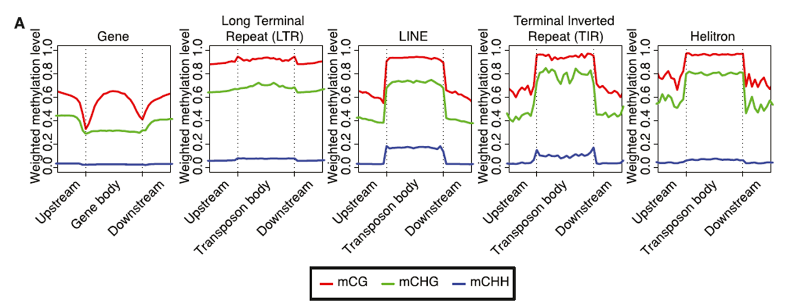

*From Schmitz et al., 2013, GenomeResearch*

A repeated meta-analysis on data from different biological conditions can immediately highlight significant and widespread changes in DNA methylation profiles, as seen in the following example comparing different developmental stages of grapevine calli at the gene level and adjacent regions:


*From Dal Santo, De Paoli et al., 2021, Plant Physiology*

---

## Rationale of the Procedure


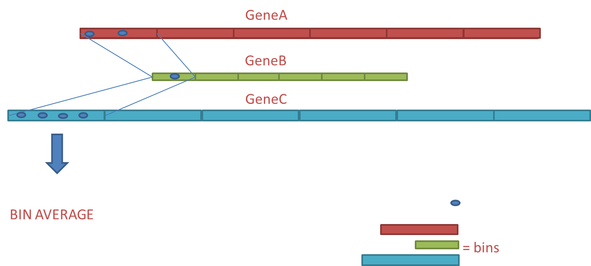

Each gene is ideally divided into 100 equal-length regions (called percentiles, intervals, or bins), numbered from 1 to 100. All cytosines present in percentile 1 of each gene are used to compute an average methylation value for percentile 1. This process is repeated for all 99 remaining percentiles.

An extract of the final file will look like this, with a percentile column (from 1 to 100) and a column containing their average methylation values.

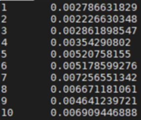


{: .note}
> The percentile lengths will be uniform within the same gene but will vary among genes due to their different sizes. However, this method allows standardization across genes of varying lengths.
>
> Another widely used approach in the literature is to analyze only the first portion of genes (choosing an arbitrary but absolute length, e.g., 500 bp) and the last portion in the same manner, without analyzing the internal gene region.


We will use the methylation table obtained from Bismark. The file represent the result of wgbs performed in _Arabidopsis thaliana_ sample.

The file is located at the following path:

`/data2/biotecnologie_molecolari_magris/epigenomics/meth_distribution/arabidopsis_wgbs.CX_report.txt`

The suffix of the file is `.CX_report.txt` as already seen in the previous lessons.
The structure is as follows:


<br>

**Figure 1:** First rows of the *arabidopsis_wgbs.CX_report.txt* file.

The file is tab separated and the columns are in the following order:
1. **chromosome**
2. **coordinate**
3. **strand**
4. **number of reads with methylation for the C**
5. **number of reads without methylation**
6. **C-context**
7. **trinucleotide context**

<!--
## Input Dataset

For this analysis, a methylome table is required, such as the one generated by the Bismark software pipeline.

For this exercise, a methylome table of *Arabidopsis thaliana* is used. The file, at the time this tutorial was written, is located at the following path on the teaching server:

```
/biotecnologie_molecolari_depaoli/bismark_methylome_example/Arabidopsis_wgbs.CX_report.txt
```

The file ends with the suffix `...CX_report.txt` and is structured as follows:

The different columns (accessible in AWK with `$1`, `$2`, `$3`, etc.) indicate, in order:

- Chromosome
- Cytosine position
- DNA strand
- Reads showing methylation at that cytosine
- Reads not showing methylation
- Context type (CG/CHG/CHH)
- Actual sequence context

---

## Filtering and Fractioning the Methylome Table

The initial methylome table must be filtered to remove cytosine positions not covered by any reads (`($4+$5)>0`). It must then be split into three separate files containing only the CG, CHG, and CHH contexts, respectively. For faster computation during the exercise, only chromosome 1 (Chr1) data will be used, although ideally, data from all chromosomes should be included.

This step is common to a previous exercise and can be skipped if the required files are already available.

**Command-line operations (Linux terminal):**

```sh
$ awk '{if ($1=="Chr1" && ($4+$5)>0 && $6=="CG") print $0}' "Arabidopsis_wgbs.CX_report.txt" > Arabidopsis_Chr1_CG.txt
$ awk '{if ($1=="Chr1" && ($4+$5)>0 && $6=="CHG") print $0}' "Arabidopsis_wgbs.CX_report.txt" > Arabidopsis_Chr1_CHG.txt
$ awk '{if ($1=="Chr1" && ($4+$5)>0 && $6=="CHH") print $0}' "Arabidopsis_wgbs.CX_report.txt" > Arabidopsis_Chr1_CHH.txt
```
-->

---

# 1. Filter the dataset 

The initial methylome table must be filtered to remove cytosine positions not covered by any reads. We will use again `awk` for this purpose. It must then be split into three separate files containing only the `CG`, `CHG`, and `CHH` contexts, respectively. For faster computation during the exercise, only chromosome 1 (Chr1) data will be used, although ideally, data from all chromosomes should be included.

The file has been already used in the previous tutorial. (add link)

The file is located at the following path:

`/data2/biotecnologie_molecolari_magris/epigenomics/meth_distribution/arabidopsis_wgbs.CX_report.txt`

It should be already available in your directory:
`/data2/student_space/st24_16_folder/epigenomics/methylation_distribution/`


```bash
# Move the working directory
cd /data2/student_space/st24_16_folder/epigenomics/

# Create a new directory for this tutorial
mkdir -p meta_analysis/

# Move inside the new directory
cd meta_analysis/

# Filter the input file in order to keep only the methylation context of interest (CG) 
# and to keep sites located on Chr1 with a coverage greater than 0
awk '{ if ($1=="Chr1" && ($4+$5)>0 && $6=="CG") {meth = $4/($4+$5); print $0"\t"meth}}' \
../methylation_distribution/arabidopsis_wgbs.CX_report.txt > arabidopsis_chr1_CG_meth.txt

# For CHG
awk '{ if ($1=="Chr1" && ($4+$5)>0 && $6=="CHG") {meth = $4/($4+$5); print $0"\t"meth}}' \
../methylation_distribution/arabidopsis_wgbs.CX_report.txt > arabidopsis_chr1_CHG_meth.txt

# For CHH
awk '{ if ($1=="Chr1" && ($4+$5)>0 && $6=="CHH") {meth = $4/($4+$5); print $0"\t"meth}}' \
../methylation_distribution/arabidopsis_wgbs.CX_report.txt > arabidopsis_chr1_CHH_meth.txt
```

The files obtained will look like:

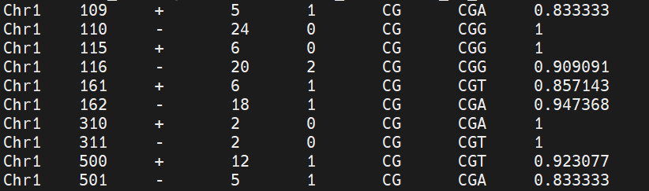

# 2. Convert filtered Bismark output to BED Format

Since the meta-analysis can be performed using [`bedtools`](https://bedtools.readthedocs.io/en/latest/), the methylation files need to be converted into BED format.

Remember that coordinates in bed file are 0-based . The first column is the chromosome, the second is the start position, the third is the end position, and the fourth is the name of the feature (in this case, the methylation value).

In order to transform the methylation tables into BED format, we will use the following commands:

```sh
# For the CG context 
awk '{chr=$1; start=$2 - 1; end=$2; meth=$8; print chr"\t"start"\t"end"\t"meth}' \
arabidopsis_chr1_CG_meth.txt > arabidopsis_chr1_CG_meth.bed

# For the CHG context
awk '{chr=$1; start=$2 - 1; end=$2; meth=$8; print chr"\t"start"\t"end"\t"meth}' \
arabidopsis_chr1_CHG_meth.txt > arabidopsis_chr1_CHG_meth.bed

# For the CHH context
awk '{chr=$1; start=$2 - 1; end=$2; meth=$8; print chr"\t"start"\t"end"\t"meth}' \
arabidopsis_chr1_CHH_meth.txt > arabidopsis_chr1_CHH_meth.bed

```

We named the output files with `bed` suffix in order to remember that it is in 0-based coordinate system.

The file now should look like:

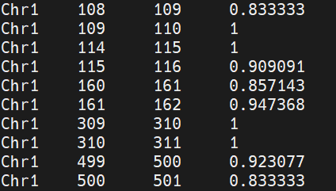


# 3. Prepare gene coordinates file to be used by bedtools (GFF to BED conversion)

In order to perform a meta-analysis, bedtools will be used in order to divide the genic regions of the genome ("Chr1" in this tutorial) in percentile of lenght. We will start from a set of coordinates of the genes in the genome. Gene coordinates are represented in `gff` format. Each row represent a gene with the chromosome, the start and end position.


Using the bedtools makewindows function, we can convert the [gff](2a1_file_formats.html#annotations). file into a bed file with a list of coordinates of each of the 100 percentiles (each row will represent a percentile of length of a gene, and percentiles are numbered in the last column on the right).

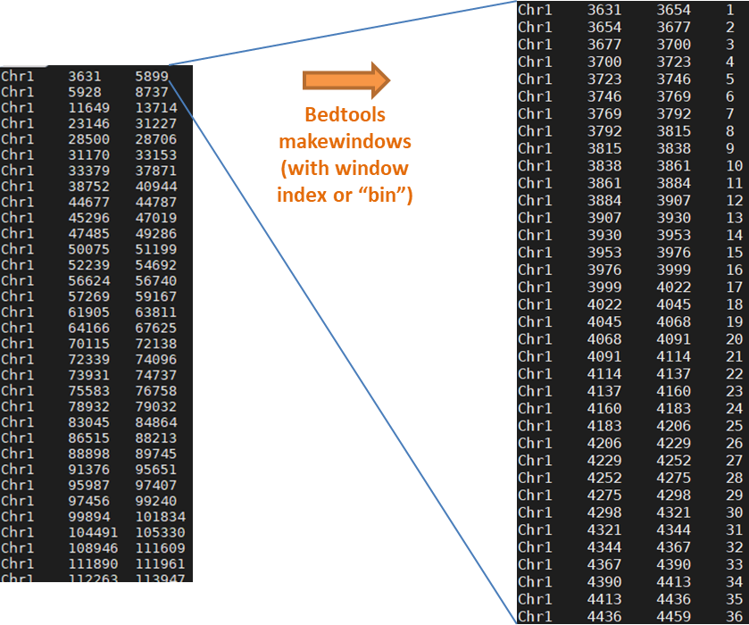

We are interested only in the rows that report the start and end coordinates of the genes, thus those lines with the feature "gene" in the 3<sup>th</sup> column. Also the row with the feature "mRNA" which represent the transcripts could be used. Important to remember that gff files may report different transcripts per gene, and thus it will be necessary to decide which transcript to consider for the meta-analysis.


The gff file of *Arabidposis thaliana* with already the transcripts selected is available in the directory 
`/data2/biotecnologie_molecolari_magris/epigenomics/meta_analysis/arabidopsis_transcript.gff`

We need to transform it into a bed file

```sh
awk '{chr=$1; start=$4 - 1; end=$5; print chr"\t"start"\t"end}' \
/data2/biotecnologie_molecolari_magris/epigenomics/meta_analysis/arabidopsis_transcript.gff \
> arabidopsis_transcript.bed
```

The obtained file includes genes on both genome strands (column 7 of the GFF file), but the GFF format requires the start coordinate to always be smaller than the end coordinate, even for genes on the negative strand. To prevent percentiles from being numbered in reverse order for these genes (from 1 to 100 starting from the end), two slightly different procedures must be followed for the positive and negative strands.

Therefore, it is best to split the `arabidopsis_transcript.bed` file into two separate files for genes on each strand, starting from the previous command.

```sh
# For positive strand
awk '{chr=$1; start=$4 - 1; end=$5;strand=$7; if(strand == "+") print chr"\t"start"\t"end}' \
/data2/biotecnologie_molecolari_magris/epigenomics/meta_analysis/arabidopsis_transcript.gff \
> positive_arabidopsis_transcript.bed

# For negative strand 
awk '{chr=$1; start=$4 - 1; end=$5;strand=$7; if(strand == "-") print chr"\t"start"\t"end}' \
/data2/biotecnologie_molecolari_magris/epigenomics/meta_analysis/arabidopsis_transcript.gff \
> negative_arabidopsis_transcript.bed
```


# 4. Divide genes into percentiles

Now each gene can be divided into 100 percentiles of length. This is done using the bedtools makewindows.


```sh
bedtools makewindows \
-b positive_arabidopsis_transcript.bed \
-n 100 \
-i winnum \
> positive_tr_bins.bed

# and for negative oriented genes 
bedtools makewindows \
-b negative_arabidopsis_transcript.bed \
-n 100 \
-i winnum \
-reverse \
> negative_tr_bins.bed
```
The options used:

- `-b` : input file in bed format
- `-n` : number of windows (percentiles) to divide the genes in 
- `-i` : a name column added as fourth columns, which indicate the window number
- `-reverse` : reverse the order of the windows for genes on the negative strand

We will get two files, one for each strand, with the genes divided into 100 percentiles of length. For example:

```bash
head positive_tr_bins.bed
```

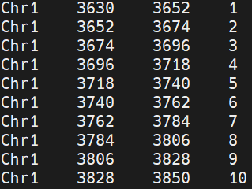

```bash
head negative_tr_bins.bed
```

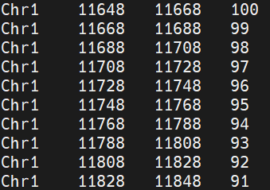


Now we can merge the two files into one, using the command `cat`. We will also sort the file by the chromosome and the start position of the genes, to make it easier to use with the next commands of bedtools. In order to intersect the data, the file need to be coordinate sorted.

```sh
cat positive_tr_bins.bed negative_tr_bins.bed | \
sort -k1,1 -k2,2n > transcript_bins.bed
```

With sort -k1,1 -k2,2n , we are sorting the file by the first column (chromosome) and the second column (start position) in numerical order. The n value at the end of the second column indicates that the sorting should be done in numerical order (and not lexicographic, thus 2 will be placed after 1, and not after 10).


# 5. Intersect percentile coordinates with Cytosine coordinates

We can now proceed with the intersect of the obtained percentiles with the cytosine coordinates. We will use the bedtools intersect command.
Bedtools intersect will try to find overlap between two datasets.

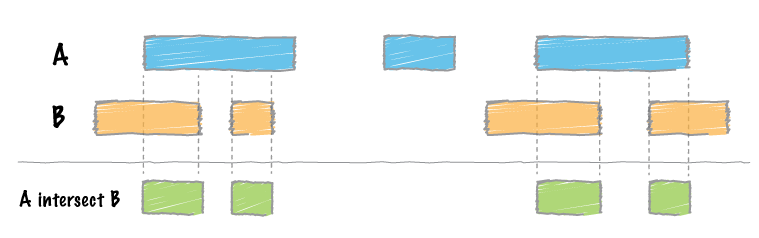

The two required files are:

1. the bed file with percentiles (transcript_bins.bed)
2. the bed file with cytosine coordinates (arabidopsis_chr1_CG.bed)

We can now intersect the two datasets.

```sh
bedtools intersect \
-a transcript_bins.bed \
-b arabidopsis_chr1_CG_meth.bed \
-wa -wb \
> intersect_CG.txt
```

The options used:

- `-a` : files A with features to be compared with file B
- `-b` : file B with features to be compared with file A
- `-wa`: report the original "A" feature when an overlap is found
- `-wb`: report the original "B" feature when an overlap is found

{: .note }
Both **-wa** and **-wb** are used, the originals features of both "A" and "B" will be reported.


The output will contain all the features from the first file (transcript_bins.bed). If two or more Cs intersect with the same percentile, the rows (the values of percetiles) will be repeated for each cytosine. Percentile values that do not intersect with any cytosine will not be reported.

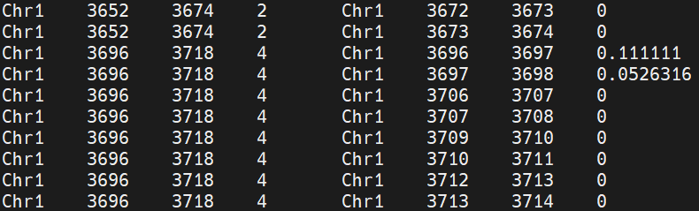


We can repeat the same for the CHG and CHH contexts. 


```sh
# For CHG context
bedtools intersect \
-a transcript_bins.bed \
-b arabidopsis_chr1_CHG_meth.bed \
-wa -wb \
> intersect_CHG.txt


# For CHH context
bedtools intersect \
-a transcript_bins.bed \
-b arabidopsis_chr1_CHH_meth.bed \
-wa -wb \
> intersect_CHH.txt
```

Now we have files with the methylation values for each percentile and each cytosine context. Since we want to draw a graph with the average values per percentile, we need to sort the files based on the percentile values. This can be easily achieved with the `sort` command.

```bash
# For CG context
sort -k4,4n intersect_CG.txt > sorted_intersect_CG.txt

# For CHG context
sort -k4,4n intersect_CHG.txt > sorted_intersect_CHG.txt

# For CHH context
sort -k4,4n intersect_CHH.txt > sorted_intersect_CHH.txt
```

We will obtain something like this:
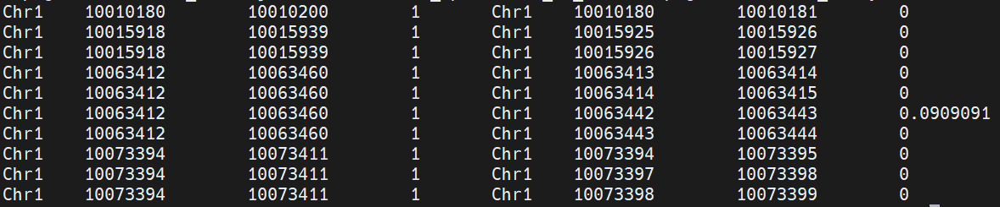


# 6. Calculating average methylation per percentile

We need now to calculate the average methylation per percentile. This can be done in different ways, for example with `awk` or using directly `bedtools`.

```sh
bedtools groupby \
-i sorted_intersect_CG.txt \
-g 4 \
-c 8 \
-o mean > CG_percentile_meth.txt
```

The options used:

- `-i` : input file to be grouped and summarized
- `-g` : specify the column to group by the input (in this case, the 4th column, which is the percentile)
- `-c` : specify the column (1-based) that should be summarized
- `-o` : specify the operation that should be applied to the selected columns (in this case, the mean)

The obtained file will have the average methylation per percentile (from 1 to 100), and will look like

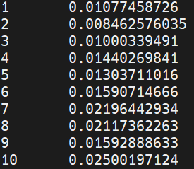

We can repeat the same for the other two contexts 


```sh
# For CHG context
bedtools groupby \
-i sorted_intersect_CHG.txt \
-g 4 \
-c 8 \
-o mean > CHG_percentile_meth.txt

# For CHH context 
bedtools groupby \
-i sorted_intersect_CHH.txt \
-g 4 \
-c 8 \
-o mean > CHH_percentile_meth.txt
```

# 7. Visualization of meta-analysis

Using **R** with **ggplot2**:

```r
library(ggplot2)

percentiles = read.table("CG_percentile_meth.txt", stringsAsFactors=F, header=F)
names(percentiles) = c('percentile', 'meth')
ggplot(percentiles, aes(x=percentile, y=meth)) + geom_point()
```
We should obtain something similar

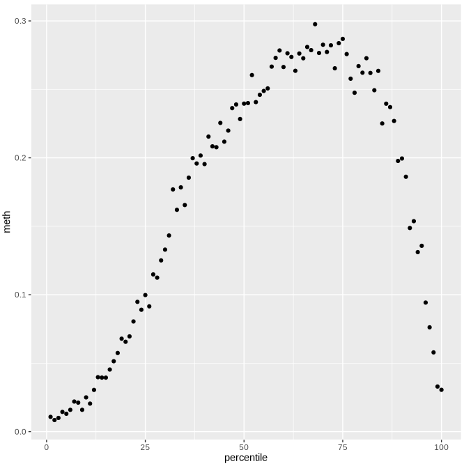


In order to save the graph as a pdf:

```r
# open the device
pdf("meta.pdf", paper="A4")

# draw the plot 
ggplot(percentiles, aes(x=percentile, y=meth)) + geom_point()
# close the device
dev.off()
```

What if we want to plot the results for each context in an unique graph?
We can read simultaneously the three datasets and overlay multiple datasets on the same graph using `geom_point` multiple times.

```r
percentilesCG = read.table("CG_percentile_meth.txt", stringsAsFactors=F, header=F)
names(percentilesCG) = c('percentile', 'meth')
percentilesCHG = read.table("CHG_percentile_meth.txt", stringsAsFactors=F, header=F)
names(percentilesCHG) = c('percentile', 'meth')
percentilesCHH = read.table("CHH_percentile_meth.txt", stringsAsFactors=F, header=F)
names(percentilesCHH) = c('percentile', 'meth')

ggplot() + 
  geom_point(data = percentilesCG, aes(x = percentile, y = meth), color = "red") +
  geom_point(data = percentilesCHG, aes(x = percentile, y = meth), color = "blue") +
  geom_point(data = percentilesCHH, aes(x = percentile, y = meth), color = "green") +
  labs(title = "Gene body methylation", x = "Percentile", y = "Methylation") +
  theme_minimal()

```

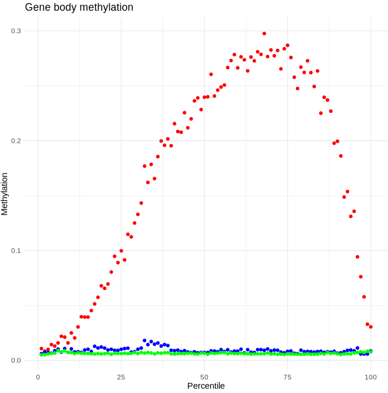