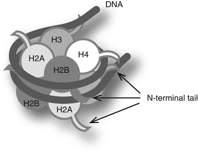
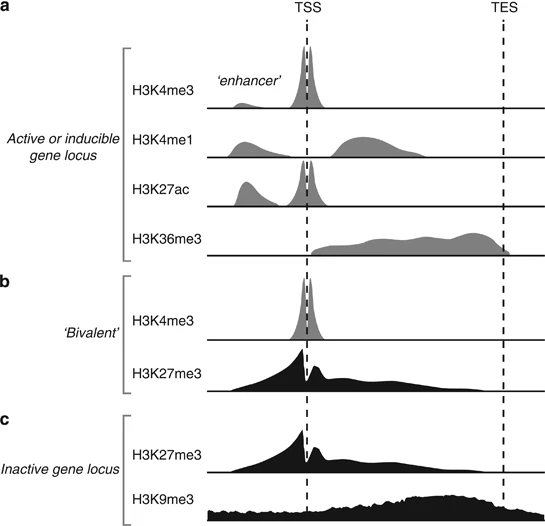
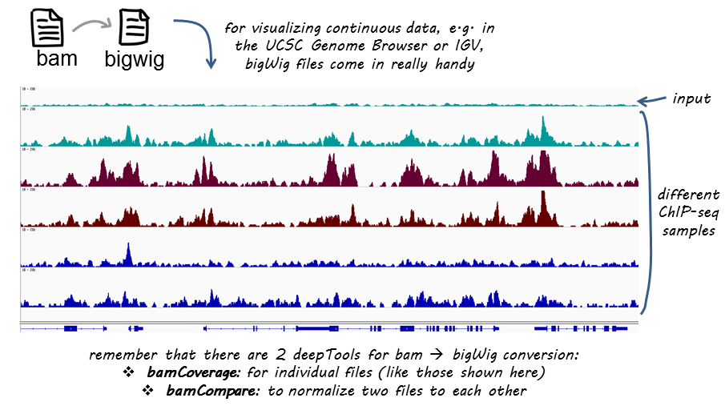
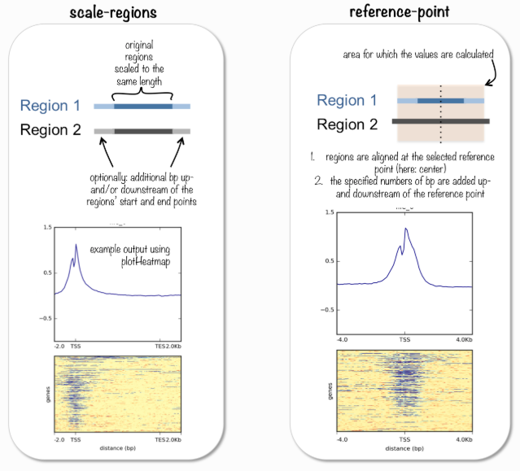
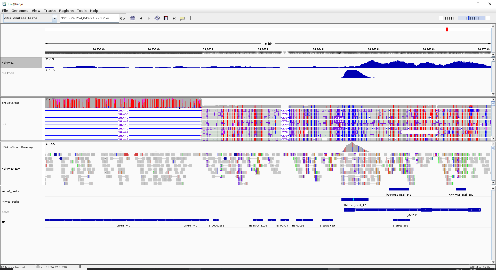
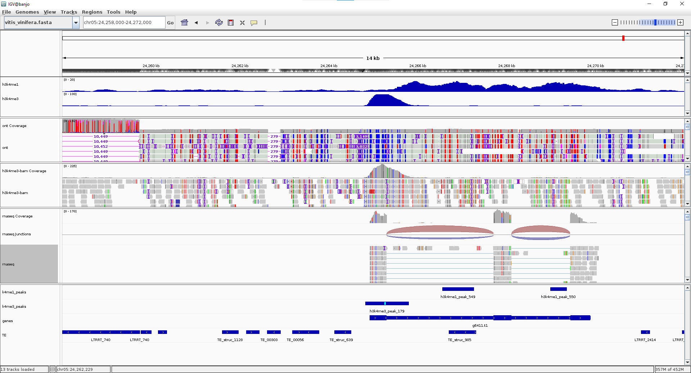

Final version
{: .label .label-green }

{: .important-title }
> Aim
>
> Perform a Chipseq analysis

<br>
<details open markdown="block">
  <summary>
    <strong>Table of contents</strong>
  </summary>
  {: .text-delta }
- TOC
{:toc}
</details>
<br>

By combining chromatin immunoprecipitation (ChIP) assays with sequencing, ChIP sequencing (ChIP-Seq) is a powerful method for identifying genome-wide DNA binding sites for transcription factors and other proteins.

In this technique, we first cross-link chromatin complexes, isolate them from the cell nuclei and fragment them. We can then purify chromatin fragments containing our protein of interest by immunoprecipitation. After this, the DNA fragments are purified and sequenced. We can use the sequencing results to determine the DNA regions our protein of interest interacts with.

After isolation and fragmentation of chromatin, the protein–DNA complexes are captured using antibodies specific to the histone or transcription factor of interest. After reversal of crosslinks, the ChIP DNA is then purified and analyzed  by high-throughput sequencing (ChIP-seq).


Our epigenome is defined as methylated DNA and modified histone proteins (around which both methylated and unmethylated DNA are wrapped). DNA methylation and histone modifications undergo global changes during transitions in developmental states and in diseases such as cancer and therefore are major contributors to the dynamic nature of chromatin.


<br>

**Figure 1:** Schematic nucleosome structure. A nucleosome consists of two copies of each core histone (H2A, H2B, H3 and H4) and ∼150 bp DNA. The N-terminal tail of each histone is extruded from the nucleosome.


Specific histone modifications may still serve as good epigenetic indicators of chromatin state, even if they are not directly involved in the regulation of gene expression. Trimethylated H3K4 (H3K4me3) is a good marker associated with actively transcribed genes. In active genes, H3K4me3 is enriched around transcription start sites (TSS) ([Figure 2](#figure-2)), whereas H3K4me2 peaks just downstream, followed by monomethylated H3K4 (H3K4me1) further downstream towards the gene body. To summarize, TSSs of actively transcribed genes are marked by H3K4me3 and H3K27ac, and active enhancers can be identified by enrichments of both H3K4me1 and H3K27ac.



**Figure 2:**   Distributions of six modifications with respect to genes are schematically illustrated. TSS, transcription start site; TES, transcription end site. H3K4me3 is enriched around TSSs. H3K4me1 is enriched around enhancers and more downstream. H3K27ac is enriched around active enhancers and TSSs. In undifferentiated stem cells, both H3K4me3 and H3K27me3 (active and inactive marks, respectively) are enriched around TSSs on many genes. H3K27me3 is enriched around inactive TSS in somatic cells. H3K9me3 is broadly distributed on inactive regions. H3K27me3 and H3K9me3 are usually not colocalized. TSSs are generally devoid of nucleosomes.


We need to add a control sample to our ChIP-seq experiment to account for non-specific binding of the antibody. Two commonly controls are used:

1. DNA isolated from the same cells but without immunoprecipitation (**input DNA**). Cells are cross-linked and fragmented, but no immunoprecipitation is performed. This DNA is then sequenced and used as a control to account for non-specific binding of the antibody [*Control for subtracting the effect of chromatin accessibility*]

2. Performing  a ChIP-seq experiment with an antibody that does not bind to the protein of interest (not known to be involved in DNA bindin or chromatin modifications, such as IgG). This is called an (**Mock IP**). [*Control for antibody specificity*] 


### Activate the conda environment
{: .no_toc }

```bash
conda activate chipseq_data
```


```bash
# Create a new directory for this tutorial
mkdir -p /data2/student_space/st24_16_folder/epigenomics/chip_seq/

# Move the working directory
cd /data2/student_space/st24_16_folder/epigenomics/chip_seq/

# Create the output folders 
mkdir -p fastqc logs trimmed alignments reference bigwig plots macs3
```

We need to create the indexes for bowtie2 which is the aligner we will use to map the reads to the genome.

```bash
# Copy the fasta file 
cp \
/data2/biotecnologie_molecolari_magris/epigenomics/wgbs/reference/vitis_vinifera.fasta reference/

# Create the indexes 
bowtie2-build reference/vitis_vinifera.fasta  reference/vitis_vinifera

# Create also the index .fai for igv visualization
samtools faidx reference/vitis_vinifera.fasta
```
<br>

# 1. H3K4me1 data analysis

We will start with the analysis of an histone modification mark, H3K4me1. We need to assess the quality of the sequencing data, trim the adapters, map the reads to the genome.

```bash
# Define a set of variables
dataset=h3k4me1
fastqpath=/data2/biotecnologie_molecolari_magris/epigenomics/chip_seq/fastq/
R1=${fastqpath}/rkatsiteli.${dataset}.R1.fastq.gz
R2=${fastqpath}/rkatsiteli.${dataset}.R2.fastq.gz
threads=2

# path to bowtie2 indexes
ref_index=reference/vitis_vinifera
```
### Check the quality of the sequencing data
{: .no_toc }

```bash
fastqc $R1 $R2 -o fastqc/
```

### Trimming with fastp
{: .no_toc }

```bash
fastp \
  -i $R1 -I $R2 \
  -w 3 \
  -o trimmed/${dataset}_1.trimmed.fastq.gz \
  -O trimmed/${dataset}_2.trimmed.fastq.gz \
  -h logs/${dataset}_fastp.html \
  -j logs/${dataset}_fastp.json
```

### Alignment with bowtie2
{: .no_toc }

```bash
bowtie2 -x $ref_index \
  -1 trimmed/${dataset}_1.trimmed.fastq.gz \
  -2 trimmed/${dataset}_2.trimmed.fastq.gz \
  -S alignments/${dataset}.sam \
  --very-sensitive \
  -p $threads 2> logs/${dataset}_bowtie2.log
```


### Convert SAM to BAM and remove duplicated reads
{: .no_toc }

```bash
samtools view \
-@ ${threads} \
-b \
-o alignments/${dataset}.bam \
alignments/${dataset}.sam 

# remove the sam file (since we have the bam file now)
rm alignments/${dataset}.sam 

# Before sorting the bam file, we will fixmate the reads # to ensure that the mate information 
# is correct, the output will be redirect to the sort command and then
# duplicated reads will be marked
#  -u options of samtools sort specify an uncompressed output

# We will combine the three commands in an unique workflow
samtools fixmate \
-@ ${threads} \
-m \
-u \
alignments/${dataset}.bam - | \
samtools sort \
-@ ${threads} \
-u \
- | \
samtools markdup \
-@ ${threads} \
--write-index \
- \
alignments/${dataset}.dedup.bam
```


In order to get a first look at our data, we can use [deeptools](https://deeptools.readthedocs.io/en/latest/content/example_usage.html), which is a suite of python tools developed for the efficient analysis of high-througput sequencing data. It is particularly useful for the analysis of ChIP-seq data. A coverage track can be generated using the `bamCoverage` function. The track can then be uploaded on igv for visualization.




```bash
bamCoverage \
  -b alignments/${dataset}.dedup.bam \
  -o bigwig/${dataset}.dedup.bw \
  --normalizeUsing RPGC \
  --effectiveGenomeSize 26902106 \
  --binSize 25 \
  --extendReads 200 \
  -p $threads
```

In order to plot a heatmap associated with genomic regions, we need to first generate a matrix file (generated with `computeMatrix`) and then draw the heatmap with `plotHeatmap`.

`computeMatrix` has two main modes of use:

- for computing the signal distribution relative to a point (reference-point), e.g., the beginning or end of each genomic region

- for computing the signal over a set of regions (scale-regions) where all regions are scaled to the same size



`computeMatrix` is tightly connected to [`plotHeatmap`](https://deeptools.readthedocs.io/en/stable/content/tools/plotHeatmap.html) and [`plotProfile`](https://deeptools.readthedocs.io/en/stable/content/tools/plotProfile.html): it takes the values of all the signal files and all genomic regions that you would like to plot and computes the corresponding data matrix.


```bash
# Compute matrix around TSS
computeMatrix reference-point \
  -S bigwig/${dataset}.dedup.bw \
  -R /data2/biotecnologie_molecolari_magris/epigenomics/chip_seq/gene_prediction/chr5_tss.bed \
  --referencePoint TSS \
  -b 3000 -a 3000 \
  --skipZeros \
  -bs 50 \
  -p $threads \
  -out plots/${dataset}_TSS_matrix.gz \
  --outFileSortedRegions plots/${dataset}_TSS_genes.bed

# Plot heatmap
plotHeatmap \
  -m plots/${dataset}_TSS_matrix.gz \
  -out plots/${dataset}_TSS_heatmap.png \
  --colorMap RdBu \
  --heatmapHeight 10 \
  --heatmapWidth 6 \
  --dpi 300
```

We can now repeat the same workflow for two other modifications:
- **h3k4me3**
- **h3k27ac**


We need to define the new dataset variable, but anything else is identical as above.

# 2. H3K4me3 data analysis

```bash
# Define a set of variables
dataset=h3k4me3
R1=${fastqpath}/rkatsiteli.${dataset}.R1.fastq.gz
R2=${fastqpath}/rkatsiteli.${dataset}.R2.fastq.gz

...
# Repeat the same command as above. 
```

# 3. H3K27ac data analysis

```bash
# Define a set of variables
dataset=h3k27ac
R1=${fastqpath}/rkatsiteli.${dataset}.R1.fastq.gz
R2=${fastqpath}/rkatsiteli.${dataset}.R2.fastq.gz

...
# Repeat the same command as above. 
```


# Peak calling
{: .no_toc}

ChIP-seq analysis algorithms are specialized in identifying one of two types of enrichment (or have specific methods for each): broad peaks or broad domains (i.e. histone modifications that cover entire gene bodies) or narrow peaks (i.e. a transcription factor binding). Narrow peaks are easier to detect as we are looking for regions that have higher amplitude and are easier to distinguish from the background, compared to broad or dispersed marks. There are also ‘mixed’ binding profiles which can be hard for algorithms to discern. An example of this is the binding properties of PolII, which binds at promotor and across the length of the gene resulting in mixed signals (narrow and broad).

A commonly used tool is named Model-based Analysis of ChIP-Seq (MACS). MACS is a model-based algorithm for peak detection in ChIP-seq data. It uses a Poisson distribution to model the background and a Gaussian distribution to model the signal. MACS can also be used to call peaks from paired-end data. 

MACS improves the spatial resolution of binding sites through combining the information of both sequencing tag position and orientation.

In order to perform peak calling - we nee to have also the INPUT control aligned to the reference genome, to be provided as input for `macs3`. 
Repeats exactly the same workflow as above, by replacing the dataset with the input sample


# 4. INPUT data analysis
Commands are identical as above (for the histone modifications explored). 

```bash
# Define a set of variables
dataset=input
fastqpath=/data2/biotecnologie_molecolari_magris/epigenomics/chip_seq/fastq/
R1=${fastqpath}/rkatsiteli.${dataset}.R1.fastq.gz
R2=${fastqpath}/rkatsiteli.${dataset}.R2.fastq.gz
threads=2

# path to bowtie2 indexes
ref_index=reference/vitis_vinifera
```

### Trimming with fastp
{: .no_toc }

```bash
fastp \
  -i $R1 -I $R2 \
  -w 3 \
  -o trimmed/${dataset}_1.trimmed.fastq.gz \
  -O trimmed/${dataset}_2.trimmed.fastq.gz \
  -h logs/${dataset}_fastp.html \
  -j logs/${dataset}_fastp.json
```

### Alignment with bowtie2
{: .no_toc }

```bash
bowtie2 -x $ref_index \
  -1 trimmed/${dataset}_1.trimmed.fastq.gz \
  -2 trimmed/${dataset}_2.trimmed.fastq.gz \
  -S alignments/${dataset}.sam \
  --very-sensitive \
  -p $threads 2> logs/${dataset}_bowtie2.log
```


### Convert SAM to BAM and remove duplicated reads
{: .no_toc }

```bash
samtools view \
-@ ${threads} \
-b \
-o alignments/${dataset}.bam \
alignments/${dataset}.sam 

# remove the sam file (since we have the bam file now)
rm alignments/${dataset}.sam 

# Before sorting the bam file, we will fixmate the reads # to ensure that the mate information 
# is correct, the output will be redirect to the sort command and then
# duplicated reads will be marked
#  -u options of samtools sort specify an uncompressed output

# We will combine the three commands in an unique workflow
samtools fixmate \
-@ ${threads} \
-m \
-u \
alignments/${dataset}.bam - | \
samtools sort \
-@ ${threads} \
-u \
- | \
samtools markdup \
-@ ${threads} \
--write-index \
- \
alignments/${dataset}.dedup.bam
```

<br>

Now we have available the two bam files (for example h3k4me3 and input) and we can perform peak calling using `macs3`.

```bash
macs3 callpeak \
  -t alignments/h3k4me3.dedup.bam \
  -c alignments/input.dedup.bam \
  -f AUTO \
  -g 26902106 \
  -n h3k4me3 \
  --outdir macs3 \
  --nomodel \
  --shift -100 \
  --extsize 200 \
  -q 0.01
```
<br>
Repeat the same for h3k4me1 and we can perform peak calling using `MACS3`.

```bash
macs3 callpeak \
  -t alignments/h3k4me1.dedup.bam \
  -c alignments/input.dedup.bam \
  -f AUTO \
  -g 26902106 \
  -n h3k4me1 \
  --outdir macs3 \
  --nomodel \
  --shift -100 \
  --extsize 200 \
  --broad \
  -q 0.01
```

# Upload dataset on igv 
{: .no_toc}


```bash
igv \
-g reference/vitis_vinifera.fasta \
-l chr05:24258000-24272000 \
../ont/alignments/rkatsiteli.leaves.ont.sort.bam \
alignments/h3k4me3.dedup.bam \
/data2/biotecnologie_molecolari_magris/epigenomics/chip_seq/gene_prediction/rnaseq.chr05.bam \
bigwig/h3k4me1.dedup.bw \
bigwig/h3k4me3.dedup.bw \
macs3/h3k4me1_peaks.broadPeak \
macs3/h3k4me3_peaks.narrowPeak \
/data2/biotecnologie_molecolari_magris/epigenomics/chip_seq/gene_prediction/chr05.genes.gtf \
/data2/biotecnologie_molecolari_magris/epigenomics/chip_seq/te_prediction/chr05.TE.gff3 \
-n ont,h3k4me3-bam,rnaseq,h3k4me1,h3k4me3,k4me1_peaks,k4me3_peaks,genes,TE
```
<!--

-->

